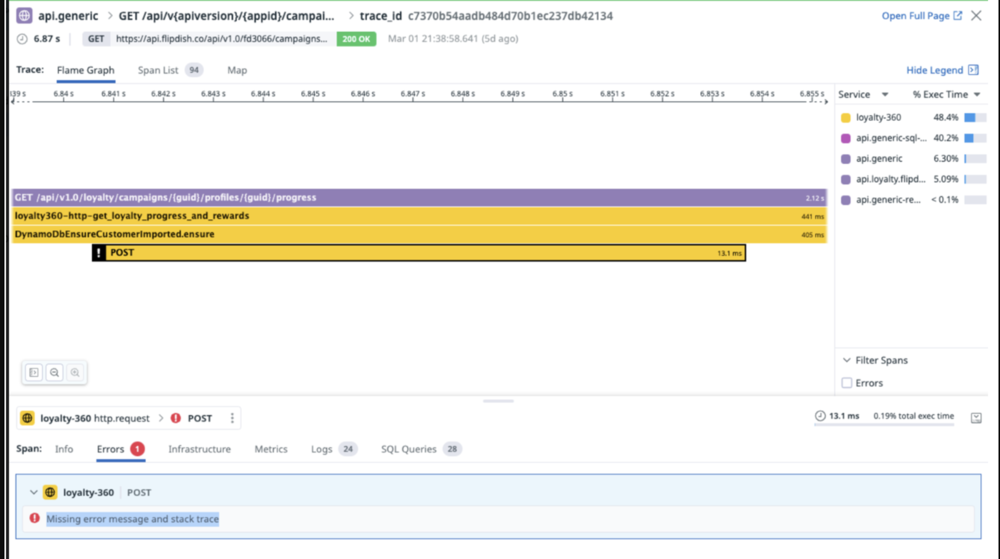

# sst-datadog-dynamodb-missing-error

The issue we're seeing is that the DynamoDB POST call is not traced by Datadog (`dd-trace`) as a DynamoDB span. And when it errors, we get a "Missing error message and stack trace" in the trace Errors. 

Datadog suggests that using the `dd-trace/esbuild` plugin will automatically instrument the DynamoDB calls. We're using the `aws-sdk` and the `@aws-sdk/client-dynamodb` package to make the calls.