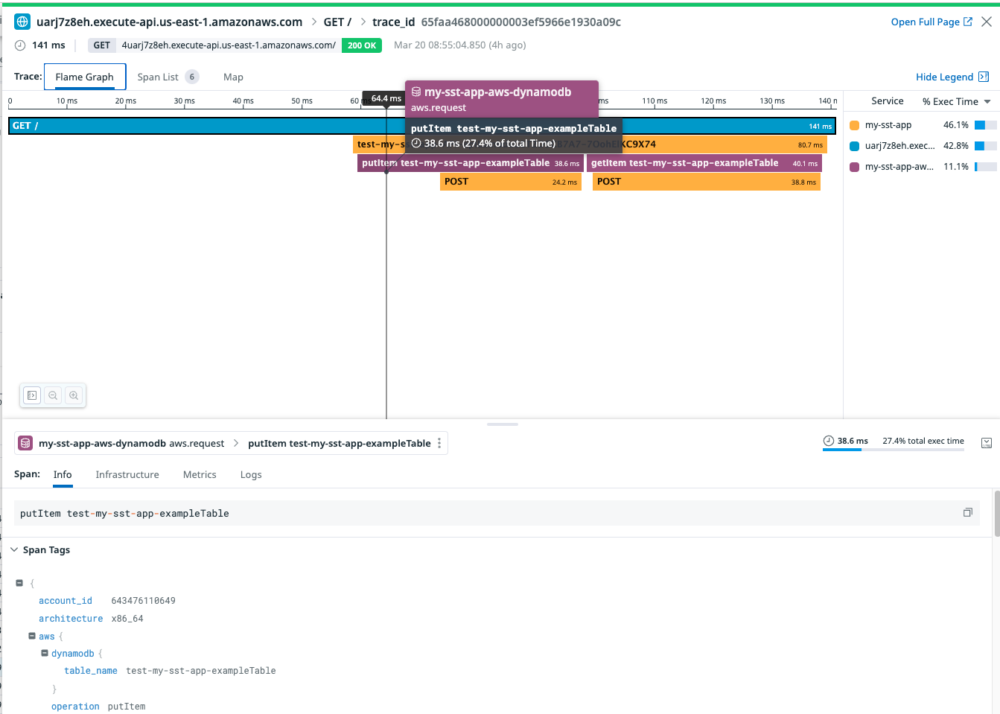

# sst-datadog-dynamodb-missing-error

The issue we're seeing is that the DynamoDB POST call is not traced by Datadog (`dd-trace`) as a DynamoDB span. And when it errors, we get a "Missing error message and stack trace" in the trace Errors. 


But we definitely get an `http.request` span for DynamoDB in our use case in production. 


We would expect to get something like this with the `putItem` and `getItem` calls to DynamoDB.


## Solution #1: Use esbuild plugin

Datadog suggests that using the `dd-trace/esbuild` plugin will automatically instrument the DynamoDB calls. We're using the `aws-sdk` and the `@aws-sdk/client-dynamodb` package to make the calls.

Adding the dd plugin is [recommended by Datadog](https://docs.datadoghq.com/tracing/trace_collection/automatic_instrumentation/dd_libraries/nodejs/#bundling) to configure esbuild to maximise `dd-trace`'s potential of tracing 3rd party libraries.

Unfortunately, this doesn't work because AWS CDK does not allow us to use the esbuild plugin functionality. We still get the same issue if we try to use the bundle (TODO: how?)


From AJ Stuyvenberg:

> This appears to be a configuration issue combined with the fact that CDK doesn’t support ESBuild Plugins effectively. You can see this in two issues documented in both ESBuild and CDK:
https://github.com/evanw/esbuild/issues/884, 
https://github.com/aws/aws-cdk/issues/18470


## OK, what now?

So the latest suggestion is that we have two options:

1. Exclude the `aws-sdk` library entirely from being bundled by setting it as external in the esbuild config. This will allow `dd-trace` to instrument the calls the `aws-sdk` library makes as it is.
2. Use the esbuild plugin and prebundle the application manually using esbuild from the CLI, and then pass that artifact to the CDK

 ## Solution #2: Exclude `aws-sdk` from being bundled

Let's try the first option.

What we currently get:


No DynamoDB span present. 

If we exclude the `aws-sdk` library from being bundled, we should see the DynamoDB spans.

```ts
app.setDefaultFunctionProps({
    nodejs: {
    esbuild: {
        external: ["datadog-lambda-js", "dd-trace", "aws-sdk"],
        plugins: [ddPlugin],
    },
    },
    environment: {
    DD_TRACE_DISABLED_PLUGINS: "dns",
    },
});
```


The Node 18 runtime includes the AWS SDK v3 but not the AWS SDK v2, so there are two options again:

1. Add the AWS SDK v2 as a layer to the function
2. Use the esbuild plugin and prebundle the application manually using esbuild from the CLI, and then pass that artifact to the CDK (as suggested by Datadog)

Let's try the first option.

([ChatGPT](https://chat.openai.com/share/b99f1ceb-eb5d-4b39-9041-394ad05a4553) did a good job with instructions here)

To create the layer, we need to install the `aws-sdk` package and then zip the `node_modules` folder. 

```bash
mkdir aws-sdk-layer
cd aws-sdk-layer
mkdir nodejs
cd nodejs
npm init -y
npm install aws-sdk
```

Then zip the layer:

```bash
cd ..
zip -r aws-sdk-layer.zip .
```

Used the aws cli again to create the layer:

```bash
aws lambda publish-layer-version --layer-name aws-sdk-layer --zip-file fileb://aws-sdk-layer.zip --compatible-runtimes nodejs14.x nodejs16.x nodejs18.x
```

We could do this via [AWS CDK](https://docs.aws.amazon.com/cdk/api/v2/docs/aws-cdk-lib.aws_lambda.LayerVersion.html), too. But for the purpose of this demo, I'm doing it via the CLI first to prove the case. 

Doing it this way, wipes the existing layers and adds the new layer (which is not what we want). 

So I'll add the layer via the CDK, instead.

```ts
const { Stack, LambdaLayer } = require('@serverless-stack/resources');

class MyStack extends Stack {
  constructor(scope, id, props) {
    super(scope, id, props);

    const awsSdkLayer = new LambdaLayer(this, 'AwsSdkLayer', {
      code: LambdaLayer.fromAsset('path/to/aws-sdk-layer.zip'),
    });

    // Define your Lambda function and add the layer
    const myFunction = new Function(this, 'MyFunction', {
      handler: 'path/to/handler.function',
      layers: [awsSdkLayer],
    });
  }
}

module.exports = MyStack;
```

Interestingly, ChatGPT hallucinated that sst has a "LambdaLayer" construct. It doesn't. 

What we actually want is this:

```ts
  const awsSdkLayer = new LayerVersion(stack, 'AwsSdkLayer', {
    removalPolicy: RemovalPolicy.RETAIN,
    code: Code.fromAsset('../aws-sdk-layer/aws-sdk-layer.zip'),
    compatibleRuntimes: [Runtime.NODEJS_18_X],
  });
```

And then configure the functions in the stack to use this layer:


```ts
defaults: {
  function: {
    bind: [bus, table],
    environment: {
      DD_TRACE_DISABLED_PLUGINS: "dns",
    },
    layers: [awsSdkLayer.layerVersionArn]
  },
},
```

And this works beautifully 🎉 

We get all 3 layers on each function (the 2 Datadog layers and the aws-sdk layer):


We get the DynamoDB span as expected when no errors apear:

### List of spans


### Flamegraph



And when there's an error, we get the error message and stack trace as expected:


Note: I have not tried "pre-bundling" yet. I'll try that next.